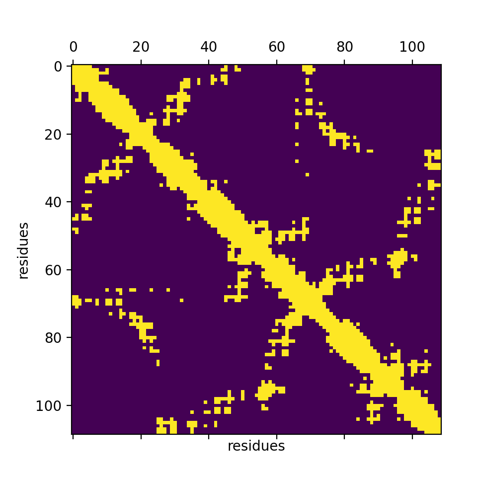
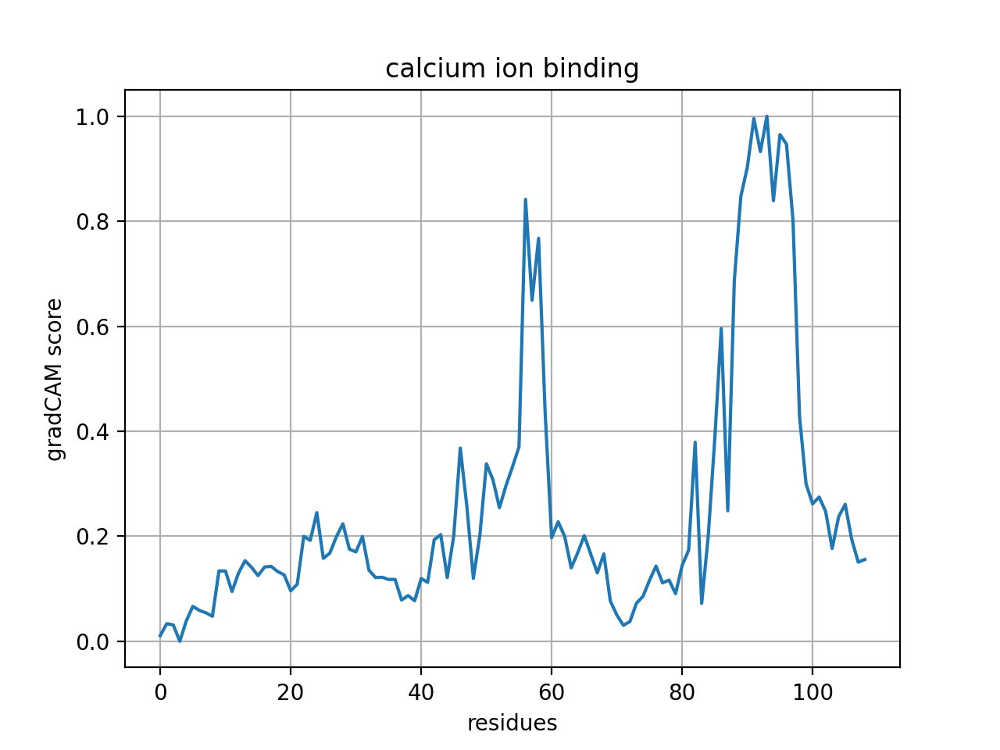

# Repository containing pre-trained DeepFRI models

* model for predicting (n=942) Molecular Function (MF) GO terms: `DeepFRI-GraphConv_MF_model`
* model for predicting (n=1376) Enzyme Commission (EC) numbers: `DeepFRI-GraphConv_EC_model

GO/EC names and IDs are provided in the corresponding `.json` files.

## Setup

Clone the repository:
```bash
git clone https://github.com/VGligorijevic/DeepFRI-models
cd DeepFRI-models
```

*DeepFRI* is tested to work under Python 3.7
Next, install dependencies:
```bash
pip install tensorflow==2.3.1
pip install matplotlib
```

## Loading the data

```python
import numpy as np
import matplotlib.pyplot as plt

# load a distance map and sequence (preprocessed from a PDB file)
pdb = np.load('./pdb_examples/1S3P-A.npz')
dist = pdb['C_alpha']

# contact map with 10A dist threshold
cmap = np.asarray(dist < 10.0, dtype=np.float32)
sequence = str(pdb['seqres'])

# sanity checks (display sequence and contact map)
print (sequence)

plt.figure()
plt.matshow(cmap)
plt.xlabel("residues")
plt.ylabel("residues")
plt.show()

```
### Output:
```
SMTDLLSAEDIKKAIGAFTAADSFDHKKFFQMVGLKKKSADDVKKVFHILDKDKDGFIDEDELGSILKGFSSDARDLSAKETKTLMAAGDKDGDGKIGVEEFSTLVAES
```



## Loading the pretrained model and making predicitons (MF-GO terms)
* INPUT:
`
A (shape=(1, L, L)) - contact map (10A cutoff, L-protein length)
S (shape=(1, L, 26)) - one-hot encoding of sequence (26 - number of residues)
`

* OUTPUT:
`
Preds (shape=(#goterms, )) - prediction probabilities for each GO term
`


```python

# load model
model = tf.keras.models.load_model('./models/DeepFRI-GraphConv_MF_model')
model.summary()

# alternatively (using tensorflow functions)
# model = tf.saved\_model.load('./models/DeepFRI-GraphConv\_MF\_model')

# load metadata (GO-terms & GO-names)
with open("./models/DeepFRI-GraphConv_MF_model_metadata.json") as json_file:
    params = json.load(json_file)
    goterms = params['goterms']
    gonames = params['gonames']

# making predictions (export top 10 predictions with the highest scores)

# formatting inputs
sequence = np.asarray([list(sequence)])
S = model.encode(sequence)  # (build-in function for computing one-hot encoding)
A = cmap.reshape(1, *cmap.shape)

Preds = model([A, S])
sorted_idx = np.argsort(Preds)[::-1]

print ('\n\n')
print ("Score | GO term")
print ("-----------------------------")
for i in sorted_idx[:10]:
    print ("%0.3f | %s" % (Preds[i].numpy(), gonames[i]))
```
### Output:


```txt

Score | GO term
-----------------------------
0.996 | calcium ion binding
0.038 | transition metal ion binding
0.028 | identical protein binding
0.022 | cytoskeletal protein binding
0.021 | DNA binding
0.021 | protein-containing complex binding
0.020 | molecular carrier activity
0.019 | molecular function regulator
0.016 | iron ion binding
0.009 | vitamin binding
```


## Computing Class Acitvation Map
* INPUT:
`
A (shape=(1, L, L)) - contact map (10A cutoff, L-protein length)
S (shape=(1, L, 26)) - one-hot encoding of sequence (26 - number of residues)
goidx (shape=None) - GO term index in the list
`


* OUTPUT:
`
residue\_scores (shape=(L, )) - prediction score for each residue
`

```python
# extract index of the target GO term (using GO ID) from a list of GO terms
goidx = goterms.index("GO:0005509")

# alternatively (using GO name)
# goidx = gonames.index("calcium ion binding")

residue_scores = model.gradCAM([A, S], goidx)
plt.figure()
plt.plot(residue_scores.numpy())
plt.xlabel("residues")
plt.ylabel("gradCAM score")
plt.title(gonames[goidx])
plt.grid()
plt.show()
```


### Output:


